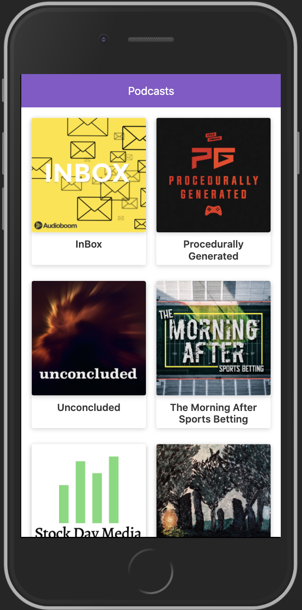

# Podcast App with Next.JS

Podcast App integrated with Audioboom API for learn Next.JS.

## ¿How it works?

Require Node 10
* `npm install` for install dependencies.
* `npm run dev` for run development mode.
* `npm run build && npm start` for production mode.

## Licence
MIT